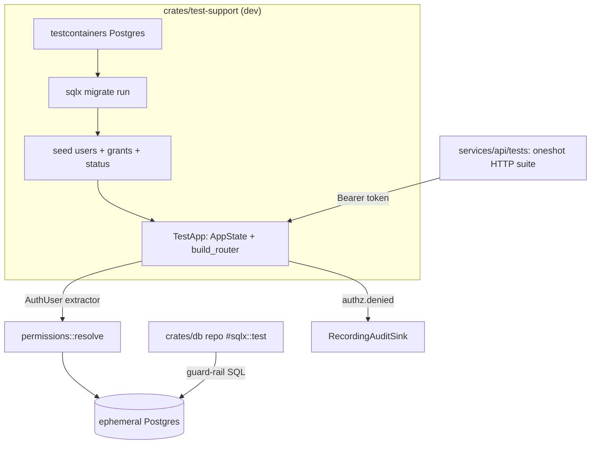

# Requirements

### Overview & Goals

TankoVault is already an unusually mature Rust workspace: a per-capability authorization model resolved fresh from the database on every request (`services/api/src/state.rs`), audited authorization denials, rate limiting, an SSRF guard in the `fetch` crate, Argon2id password hashing with a server-side pepper, hashed rotating refresh tokens with reuse detection, feature flags, GDPR endpoints, and a strong CI pipeline (`fmt` + `clippy -D warnings` + `cargo-deny` + `cargo-audit` + an sqlx offline-cache check against a real Postgres + wasm check + a Docker build matrix).

The single biggest gap is **automated verification of behavior**, and it is most acute exactly where it matters most — access control:

- The API service (`services/api`) has **only pure-logic unit tests**. There is not one test that boots the router and asserts that a privileged endpoint returns `401`/`403`/`200` for the right caller. Authorization correctness is currently proven only by a **manual** end-to-end smoke script.
- The `db` repository layer has **almost no DB-backed tests** — `crates/db/src/repo/*.rs` contains only pure-logic unit tests (e.g. `gdpr.rs`). The SQL that enforces authorization (permission resolution, the last-admin guard, suspension, `/me/*` ownership) is untested automatically, even though design DoD §21 explicitly promised "a Postgres-backed repo test via sqlx's test harness."
- CI's `test` job runs with `SQLX_OFFLINE=true` and **no database**, so DB-backed and HTTP integration tests could not run even if they existed.

The goal of this plan is a **stable, well-maintained, secure, performant, production-ready** codebase, delivered by: (1) an authoritative analysis-and-roadmap document, (2) a real automated test pyramid centered on access control, (3) concrete security hardening, and (4) a focused production-readiness/hardening layer.

### Scope

**In scope**
- A new analysis & roadmap document under `docs/` capturing findings and prioritized suggestions.
- A shared integration-test harness that stands up an ephemeral Postgres via **testcontainers** and drives the real Axum router in-process via `tower::ServiceExt::oneshot`.
- **Repo-layer** access-control tests (`#[sqlx::test]`) for the SQL guard rails.
- **HTTP-layer** access-control tests: per permission-gated endpoint `401` (no token), `403` (authenticated but missing capability), `200`/`2xx` (authorized), suspended-account rejection, `/me/*` ownership, and audit-on-deny.
- Auth-flow integration tests: refresh rotation + reuse-detection family revocation, password reset/verify token expiry.
- Security hardening: fail-fast startup validation of secrets, CSRF posture for the cookie refresh flow, CSP headers on the web edge, and reconciliation of stale security docs.
- Production-readiness hardening: CI wiring for the new suites, dependency/supply-chain automation, and observability/resilience checks.

**Out of scope**
- Any change to the product's functional behavior or the "links, not content" invariant.
- Frontend UX redesign work.
- Rewriting the existing manual smoke script (it is retained as a complementary black-box check).

### User Stories
- As a **maintainer**, I want automated access-control tests so that a privilege-escalation regression fails CI instead of reaching production.
- As a **security reviewer**, I want a documented, current threat/posture doc and fail-fast secret validation so that a misconfigured deployment cannot boot with a weak/empty JWT secret.
- As an **operator**, I want DB-backed tests of the last-admin guard and suspension so that I trust the console cannot lock everyone out or leave a suspended account able to act.
- As a **contributor**, I want `cargo test` to work identically locally and in CI so that I can reproduce failures without wiring up service containers.

### Functional Requirements
- Every permission-gated route has an automated test asserting rejection without the capability and success with it; denials are asserted to produce an `authz.denied` audit event.
- The permission-resolution SQL (`crates/db/src/repo/permissions.rs::resolve`) is tested against a real schema, including the suspended-status path (`may_authenticate()`).
- The last-admin/critical-capability guard (`permissions::other_active_holders`) and `user_admin::set_status` are tested to prove the last holder of a critical capability cannot be removed/suspended.
- `/me/*` ownership is tested (e.g. `gdpr::cancel_own` cannot cancel another user's request).
- The API refuses to start when `jwt_secret` is missing or below a minimum strength in a production profile.

### Non-Functional Requirements
- The default `cargo test --workspace` unit path stays fast and DB-free; DB-backed suites are opt-in/feature-gated so contributors without Docker are not blocked.
- Integration tests are hermetic and parallel-safe (isolated database per test, no shared mutable fixtures).
- No secret, token, or PII is ever logged or embedded in a URL, verified by the hardening work.
- All new code builds under `deny(warnings)` and passes `clippy` pedantic, consistent with the existing Definition of Done.

# Technical Design

### Current Implementation

- **Authorization** lives in `services/api/src/state.rs`: `AuthUser` is an Axum `FromRequestParts` extractor that verifies the JWT (`tankovault_auth::verify_access_token`), then calls `tankovault_db::repo::permissions::resolve(pool, user_id)` to load a fresh `PermissionSet` and account status per request. Suspended accounts are rejected before any capability check (`principal.status.may_authenticate()`). Handlers enforce capabilities with `user.require(Permission::X).await?` / `require_all(&[...])`, and a refusal records an `authz.denied` audit event.
- **The router** is assembled by `tankovault_api::build_router(state, security, ...)` in `services/api/src/lib.rs` and returns a `Router` with the full middleware stack (rate limit, body cap, CORS, security headers, feature-flag enforcement). This is directly consumable by `tower::ServiceExt::oneshot` for in-process HTTP tests.
- **Guard-rail SQL** lives in `crates/db/src/repo/`: `permissions.rs` (`resolve`, `grant`, `replace`, `other_active_holders`, `counts_for`), `user_admin.rs` (`set_status`, `update_identity`, `force_verify_email`), `gdpr.rs` (`cancel_own` ownership scoping).
- **Auth primitives** live in `crates/auth` (`token.rs`, `password.rs`, `crypto.rs::SecretBox`).
- **Config/boot**: `services/api/src/main.rs` deserializes `AuthConfig { jwt_secret, password_pepper, ... }` and moves the secret into `AppState` with **no validation** that it is present or strong; the pepper defaults to empty.
- **CI**: `.github/workflows/ci.yml` runs unit tests offline (no DB); a separate `sqlx` job runs a Postgres service purely to check the offline query cache.
- **Docs drift**: `docs/design.md` §16 still describes the removed `user`/`operator`/`admin` RBAC model, which no longer matches the implemented per-capability model documented in `state.rs`.

### Key Decisions

- **Both test layers (HTTP + repo).** HTTP `oneshot` tests exercise the real extractor, middleware, and authorization wiring end-to-end; `#[sqlx::test]` repo tests pin the SQL guard rails directly. The two layers catch different regressions (wiring vs. SQL logic) and together cover the access-control surface. *(Confirmed with user.)*
- **Testcontainers-managed Postgres.** Integration tests spin up their own Postgres container and run `sqlx migrate run` against it, so `cargo test` behaves identically locally and in CI with no service-container wiring. A shared `test-support` helper owns container lifecycle, migration, seeding, and token minting. *(Confirmed with user.)*
- **Scope = testing + security + hardening.** Beyond the explicit testing/security asks, the plan adds fail-fast config validation, supply-chain automation, and observability/resilience checks. *(Confirmed with user.)*
- **Feature-gate the DB-backed suites** (e.g. behind a `integration` feature or `#[ignore]`-by-default convention) so the fast, DB-free unit path is preserved for contributors without Docker.

### Proposed Changes

1. **`docs/PRODUCTION_READINESS.md` (new).** The authoritative findings-and-roadmap doc: current strengths, the prioritized gap list (testing, security, hardening, doc drift), the target test pyramid, the access-control test matrix, and a phased action plan cross-referencing `docs/design.md` §16/§21.
2. **`crates/test-support` (new dev crate) or a `tests/common/` module.** Provides: `spawn_postgres()` (testcontainers), `migrate(pool)`, seed builders for users with specific `PermissionSet`s and statuses, a `mint_access_token(user_id)` helper reusing `tankovault_auth`, and a `TestApp` that builds `AppState` + `build_router` and exposes a `oneshot` request helper.
3. **Repo-layer tests** in `crates/db/src/repo/*` under `#[sqlx::test]`: `permissions::resolve` (grants + suspended path), `grant`/`replace`/`other_active_holders` (last-admin guard), `user_admin::set_status`, and `gdpr::cancel_own` ownership.
4. **HTTP-layer tests** in `services/api/tests/`: an access-control matrix per permission-gated route (`401`/`403`/`2xx`), suspended rejection (expects `ApiError::Suspended`), `/me/*` ownership, and assertion that a denied call emits `authz.denied` via a capturing `AuditSink` test double.
5. **Auth-flow tests**: refresh rotation + reuse-detection family revocation; reset/verify token TTL expiry.
6. **Security hardening**: add startup validation in the config/boot path that rejects a missing/short `jwt_secret` (and warns on empty pepper) under a production profile; verify/strengthen CSRF defense on the cookie-based `/auth/refresh` flow and CSP headers on the web edge; update `docs/design.md` §16 to the per-capability model and document secret-rotation guidance.
7. **CI & supply chain**: add a testcontainers-backed integration job (Docker-enabled runner) running the new suites; add dependency-update automation (e.g. Dependabot/renovate) and confirm `cargo-audit`/`cargo-deny` gating; consider SBOM emission.
8. **Production-readiness hardening**: verify health/readiness probes and the specified Prometheus metrics are emitted, and add a resilience/smoke check scaffold (DB pool exhaustion, dependency-down degradation such as NATS-unreachable SSE `503`).

### Data Models / Contracts

```rust
// crates/test-support (dev-dependency) — shared harness
pub struct TestApp { pub router: axum::Router, pub pool: PgPool, /* container guard */ }
impl TestApp {
    pub async fn spawn() -> Self;                 // testcontainers PG + migrate + build_router
    pub async fn seed_user(&self, perms: &[Permission], status: AccountStatus) -> UserId;
    pub fn bearer(&self, user: UserId) -> String; // mint_access_token via tankovault_auth
    pub async fn request(&self, req: http::Request<Body>) -> http::Response<Body>; // oneshot
}

// Capturing audit sink test double to assert authz.denied on refusal
struct RecordingAuditSink { events: Mutex<Vec<AuditEvent>> }
impl AuditSink for RecordingAuditSink { /* push into events */ }
```

### File Structure
- `docs/PRODUCTION_READINESS.md` — new analysis & roadmap doc.
- `crates/test-support/` — new dev-only harness crate (testcontainers, seeding, token minting, `TestApp`).
- `crates/db/src/repo/permissions.rs`, `user_admin.rs`, `gdpr.rs` — add `#[sqlx::test]` modules.
- `services/api/tests/access_control.rs`, `services/api/tests/auth_flows.rs` — new HTTP integration suites.
- `services/api/src/main.rs` (+ `crates/config`) — fail-fast secret validation.
- `docs/design.md` §16 — reconcile to the per-capability model.
- `.github/workflows/ci.yml` — new integration job + dependency automation.

### Architecture Diagram



### Risks
- **Docker dependency for integration tests.** Mitigated by feature-gating/ignoring DB-backed tests by default so the fast unit path is unaffected; document the opt-in.
- **Test flakiness/slowness from container startup.** Mitigated by one shared container per test binary with per-test isolated databases (sqlx test harness pattern) and parallel-safe seeding.
- **`sqlx::test` vs testcontainers interplay.** `#[sqlx::test]` needs a `DATABASE_URL`; the harness must point it at the container (or use a container-provided URL) consistently across both layers to avoid two divergent DB setups.
- **CSRF/CSP changes could break existing flows.** Mitigated by covering the refresh flow with integration tests before/after the change and keeping `SameSite=Strict` behavior intact.
- **Fail-fast secret validation could break dev/test boot.** Mitigated by scoping strict validation to a production profile and using generated secrets in the harness.

# Testing

### Validation Approach

Build a real test pyramid on top of the existing pure-logic unit tests, with automated access-control coverage as the centerpiece. Two integration layers run against an ephemeral, testcontainers-managed Postgres: repo-layer `#[sqlx::test]` for the SQL guard rails, and HTTP-layer `oneshot` tests that exercise the real router, extractor, and middleware. Denials are verified through a capturing `AuditSink` test double so the audit trail is part of the contract, not an afterthought.

### Key Scenarios
- **Unauthenticated**: a permission-gated route returns `401` with no/invalid `Authorization` header.
- **Authenticated but unprivileged**: a valid token whose `PermissionSet` lacks the capability returns `403` and emits an `authz.denied` event naming the missing capability.
- **Authorized**: a token holding the capability succeeds (`2xx`).
- **Suspended account**: a valid token for a suspended user is rejected (`ApiError::Suspended`) before any capability check.
- **Permission resolution**: `permissions::resolve` returns the exact live grant set and correct status against a real schema.
- **Last-admin guard**: `permissions::other_active_holders` / `user_admin::set_status` prevent removing or suspending the last holder of a critical capability.
- **Ownership**: `/me/*` operations (e.g. `gdpr::cancel_own`) cannot act on another user's resource.
- **Refresh rotation**: a rotated refresh token succeeds once; replay of a used token triggers family revocation.
- **Config fail-fast**: boot is rejected with a missing/weak `jwt_secret` under the production profile.

### Edge Cases
- Expired access token, malformed `Bearer` prefix, and token signed with a different secret.
- A grant revoked between token issuance and request must take effect immediately (fresh resolution).
- `require_all` refusal audits *all* missing capabilities, not just the first.
- Reset/verify tokens past `RESET_TOKEN_TTL` / `VERIFY_TOKEN_TTL` are rejected.
- Dependency-down degradation: NATS-unreachable live stream returns `503` while durable routes keep working.

### Test Changes
- **Add**: `crates/test-support` harness; `#[sqlx::test]` modules in `crates/db/src/repo/{permissions,user_admin,gdpr}.rs`; `services/api/tests/access_control.rs` and `services/api/tests/auth_flows.rs`.
- **Add**: `RecordingAuditSink` test double for asserting audit-on-deny.
- **Keep**: existing pure-logic unit tests and the manual end-to-end smoke script (complementary black-box check).
- **CI**: new Docker-enabled integration job runs the DB-backed and HTTP suites; the existing offline `test` job remains the fast default path.

# Delivery Steps

### ✓ Step 1: Write the production-readiness analysis & roadmap doc
A new `docs/PRODUCTION_READINESS.md` captures the full repo analysis and a prioritized improvement roadmap.

- Document current strengths (per-request capability resolution in `services/api/src/state.rs`, audited denials, SSRF guard, Argon2id+pepper, hashed rotating refresh tokens, mature CI).
- Document the prioritized gaps: no HTTP-level access-control tests, near-absent DB-backed repo tests, CI running with no database, stale `docs/design.md` §16 RBAC model, and no fail-fast secret validation.
- Define the target test pyramid and an access-control test matrix (per permission-gated route: 401/403/2xx + audit-on-deny).
- Lay out the phased action plan and cross-reference `docs/design.md` §16 and §21 DoD.

### ✓ Step 2: Build the shared testcontainers + HTTP integration harness
A reusable `crates/test-support` dev crate stands up an ephemeral Postgres and the real router for tests.

- Add `spawn_postgres()` using testcontainers and run `sqlx migrate run` against it.
- Provide seed builders for users with specific `PermissionSet`s and `AccountStatus` values, and a `mint_access_token` helper reusing `tankovault_auth`.
- Provide a `TestApp` that builds `AppState` + `tankovault_api::build_router` and exposes a `tower::ServiceExt::oneshot` request helper.
- Add a `RecordingAuditSink` test double implementing `AuditSink` to capture emitted events.
- Feature-gate/ignore DB-backed usage by default so the fast DB-free unit path is preserved.

### ✓ Step 3: Add repo-layer access-control tests (sqlx::test)
The SQL guard rails in `crates/db/src/repo` are verified against a real migrated schema.

- Test `permissions::resolve` for exact live grant sets and the suspended-status path (`may_authenticate()`).
- Test `permissions::grant`/`replace`/`other_active_holders` to prove the last holder of a critical capability cannot be removed.
- Test `user_admin::set_status` (suspend/reinstate) including the last-admin protection.
- Test `gdpr::cancel_own` ownership scoping (cannot cancel another user's request).

### ✓ Step 4: Add HTTP-layer access-control and auth-flow integration tests
`services/api/tests` proves the router enforces authorization end-to-end.

- Build a per-endpoint access-control matrix asserting `401` (no token), `403` (missing capability), and `2xx` (authorized) for every permission-gated route.
- Assert a denied call emits an `authz.denied` event via `RecordingAuditSink`, naming all missing capabilities for `require_all`.
- Test suspended-account rejection and `/me/*` ownership through real requests.
- Test refresh rotation + reuse-detection family revocation and reset/verify token TTL expiry.

### ✓ Step 5: Harden security practices and reconcile security docs
Startup and edge-layer defenses are strengthened and security docs brought current.

- Add fail-fast validation in `services/api/src/main.rs`/`crates/config` rejecting a missing or below-minimum-length `jwt_secret` under a production profile, with a covering test.
- Verify and, if needed, strengthen CSRF defense on the cookie-based `/auth/refresh` flow and confirm CSP headers on the web edge.
- Rewrite `docs/design.md` §16 to describe the implemented per-capability model instead of the removed `user`/`operator`/`admin` RBAC, and document secret/pepper rotation guidance.

### ✓ Step 6: Wire CI and add supply-chain & production-readiness hardening
The new suites run in CI and the production posture is verified.

- Add a Docker-enabled CI job in `.github/workflows/ci.yml` that runs the testcontainers-backed repo and HTTP integration suites, keeping the existing fast offline `test` job as the default path.
- Add dependency-update automation (Dependabot/renovate) and confirm `cargo-audit`/`cargo-deny` gating; optionally emit an SBOM.
- Verify health/readiness probes and the specified Prometheus metrics are emitted, and add a resilience smoke scaffold (DB pool exhaustion, NATS-unreachable SSE `503` degradation).).