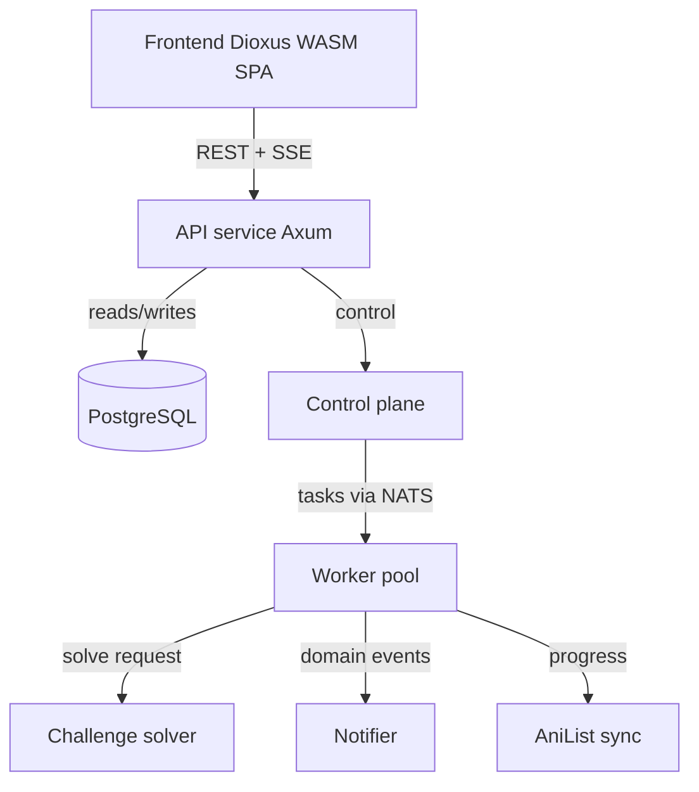

# TankoVault

> **This is a hobby project.** I build it for my own use and because building it is the point.
> There is no hosted instance, no support, no SLA and no roadmap I am committed to. It is built
> carefully — strict lints, real integration tests, a CI gate that means something — but that is
> a matter of taste, not of anyone paying for it. Issues and pull requests are welcome; I get to
> them when I get to them.

A fully-Rust, multi-service **manga / manhwa / manhua aggregator and tracker**. TankoVault indexes
series metadata across many independent provider sites, treats each work as one **canonical
series** with many **provider sources**, and layers watchlists, read progress, notifications, and
AniList sync on top.

> **Links, not content.** TankoVault stores **links and metadata only**. It never downloads, caches,
> or serves chapter images or page content. Operators remain responsible for the legality of crawling
> any given source in their jurisdiction and under each site's terms.

## Features

- **Cross-provider aggregation** — merge title, alt titles, description, tags, cover URL, status, and
  author from many sites into a single canonical series with a search vector.
- **Two scan cadences** — a rare **full scan** (rebuild the archive) and a frequent **fast scan** (pick
  up only new chapters from each provider's "latest" feed).
- **No-code provider onboarding** — config-driven adapters cover the common CMS case; custom adapters
  drop in behind the same `SourceAdapter` trait.
- **Domain-migration resilience** — stored links are relative paths resolved against the provider base
  URL at read time, so a site moving domains is a one-field change.
- **Challenge bypass** — a cheap classifier detects Cloudflare / JS / Turnstile interstitials in
  milliseconds and delegates to a pluggable challenge-solver service (TRAWL by default).
- **User system** — watchlists, read progress, per-title notification opt-in, and back-sync to
  **AniList**.
- **Operator console** — live scan progress, provider health, and adapter config editing.
- **Horizontal scale** on the API and worker tiers.

## Architecture

Eight deployable services plus shared libraries, all in one Cargo workspace. PostgreSQL is the system
of record; NATS JetStream distributes tasks and domain events; Redis backs caching, rate-limit state,
and leader election.



| Service | Role |
| --- | --- |
| `api` | Public Axum edge: auth, read models, write endpoints, admin, SSE scan feed. |
| `control-plane` | Scheduler, run planner, task fan-out, provider health; singleton leader. |
| `worker` | Fetch + parse via adapters, upsert chapter/metadata deltas. |
| `notifier` | New-chapter → user notification fan-out. |
| `sync` | AniList push/pull. |
| `challenge-solver` | Modular bot-management bypass tier (TRAWL-backed, pluggable). |
| `render` | Optional headless-browser tier for JS-rendered provider pages. |
| `frontend` | Serves the Dioxus WASM SPA and reverse-proxies `/v1/*` to the API. |

### Workspace layout

```
crates/
  domain/       pure types (Series, Chapter, Provider, enums) — no I/O
  db/           sqlx repositories and query modules
  adapters/     SourceAdapter trait + Madara/config-driven + custom adapters
  fetch/        Fetcher trait, browser emulation, rate limiting, caching, solver client
  solver/       ChallengeSolver trait + detection + TRAWL/render back-ends
  recsys/       the recommendation model as pure functions over plain data
  contracts/    NATS message/event schemas (serde)
  auth/         password hashing, JWT, RBAC guards
  config/       layered, typed config loading (file + env)
  matcher/      series canonicalisation / fuzzy matching
  service/      shared service wiring
  email/        outbound mail (lettre)
  bus/          NATS JetStream client helpers
  api-client/   generated typed client (from the OpenAPI spec)
  test-support/ shared test fixtures
services/       the eight deployable services in the table above, plus bootstrap — one-shot
                install steps (migrate, seed) shipped as its own image, so a deployment
                never carries `xtask` and its `reset`
web/frontend/   Dioxus WASM SPA + Tailwind (excluded from the host workspace)
migrations/     versioned sqlx migration SQL
deploy/         Dockerfiles, docker-compose (+ an observability overlay), local env example
xtask/          dev/ops tasks — see "Local development" below
```

## Tech stack

- **Runtime / web** — Tokio, Axum, tower / tower-http
- **Storage** — PostgreSQL 17 via SQLx (compile-time-checked SQL), Redis 7 via `fred`
- **Messaging** — NATS JetStream (`async-nats`)
- **Crawl** — `wreq` + `wreq-util` (BoringSSL; browser TLS/HTTP2 fingerprint emulation) with
  `governor` rate limiting, `scraper` HTML parsing, optional `chromiumoxide` headless render.
  Internal service-to-service HTTP stays on `reqwest` (rustls).
- **Frontend** — Dioxus (WASM) + `dioxus-router`, TailwindCSS v4
- **Security** — Argon2id password hashing, JWT access + rotating refresh tokens
- **Observability** — `tracing` + OpenTelemetry + Prometheus metrics
- **IDs / time** — UUID v7, `time`

Rust edition 2024, MSRV 1.94. Lints are strict workspace-wide (`unsafe_code = "forbid"`,
`clippy::pedantic`).

## Quick start (Docker)

The full stack runs from the repo root (the compose build context is the repo root):

```bash
docker compose -f deploy/docker-compose.yml up --build
```

This applies migrations, seeds a demo admin (`admin` / `changeme12345`) and a placeholder provider,
then starts every service and the frontend.

Open the app at **http://localhost:3000** — the `frontend` server serves the SPA and proxies `/v1/*`
to the API, so a browser needs only this one origin. The API is also exposed directly on
http://localhost:8080 for tooling.

| Service | Port |
| --- | --- |
| frontend | 3000 |
| api | 8080 |
| control-plane | 8081 |
| notifier | 8082 |
| sync | 8083 |
| render | 8084 |
| challenge-solver | 8090 |
| TRAWL | 8191 |

Apply migrations only:

```bash
docker compose -f deploy/docker-compose.yml run --rm migrate
```

See [`deploy/README.md`](deploy/README.md) for single-service image builds and reproducible
builds. `docker compose` on a single host is the only supported deployment shape today;
Kubernetes is not implemented.

## Configuration

Every service reads layered config via `tankovault-config`: optional TOML at `$TANKOVAULT_CONFIG`
(a file or a directory of fragments), overlaid by `TANKOVAULT_*` environment variables (`__`
denotes nesting, e.g. `TANKOVAULT_DATABASE__URL`), then by files — `$TANKOVAULT_SECRETS_DIR`
and `TANKOVAULT_<KEY>_FILE`. The compose file sets dev defaults inline.

Secrets should arrive as files rather than environment variables wherever the platform allows
it: the file layers keep credentials out of `/proc/<pid>/environ` and out of every child
process, and a service picks up a rotated file by rebuilding itself, with no restart.

**[`docs/CONFIGURATION.md`](docs/CONFIGURATION.md) is the complete reference** — every key, its
default, which services read it, and the failure modes worth knowing (several are silent).

**Required before any non-local use** — these have no working default and the stack fails fast
rather than booting insecure:

- `TANKOVAULT_AUTH__JWT_SECRET` — API token signing secret.
- `TANKOVAULT_AUTH__PASSWORD_PEPPER` — optional server-side pepper mixed into every argon2id hash;
  once set it must stay stable and match across the `api` and `seed` services.
- `TANKOVAULT_ANILIST__CLIENT_ID` / `__CLIENT_SECRET` / `__REDIRECT_URI` — AniList OAuth app.
- `TANKOVAULT_ANILIST__TOKEN_ENCRYPTION_KEY` — base64 32-byte key for tokens at rest
  (`openssl rand -base64 32`).

## Local development

Build, test, and lint the host workspace (the frontend is excluded and built separately):

```bash
cargo build
cargo test
# `--all-targets` silently EXCLUDES doc tests, and the `///` examples are contracts here, so
# they get their own run. CI does the same.
cargo test --workspace --doc
cargo clippy --all-targets -- -D warnings
cargo fmt --check
```

Property tests (`proptest`) live in `tests/prop_*.rs` next to the code they cover and run in that
ordinary `cargo test` — no extra toolchain. Coverage-guided fuzzing needs nightly and therefore
lives outside the workspace, in [`fuzz/`](fuzz/README.md), which no CI gate runs:

```bash
cargo +nightly fuzz build                                     # all targets compile
cargo +nightly fuzz run adapters_html_parsers \
  fuzz/corpus/adapters_html_parsers fuzz/seeds/adapters_html_parsers \
  -- -max_total_time=60 -timeout=2 -rss_limit_mb=512
```

Dev/ops tasks live in `xtask` (`migrate` / `reset` / `seed` / `sqlx-prepare` read `DATABASE_URL`;
`openapi` does not):

```bash
cargo run -p xtask -- ci              # every offline gate CI runs, in CI's order
cargo run -p xtask -- migrate         # apply pending migrations
cargo run -p xtask -- reset           # DESTRUCTIVE: drop + recreate schema (dev only)
cargo run -p xtask -- seed            # demo admin + built-in provider presets
cargo run -p xtask -- openapi         # regenerate openapi.json + the typed api-client
cargo run -p xtask -- sqlx-prepare    # refresh the committed sqlx offline query cache
cargo run -p xtask -- config-docs     # print the current TANKOVAULT_* surface
cargo run -p xtask -- notices         # regenerate THIRD-PARTY-NOTICES from both lockfiles
cargo run -p xtask -- repo-lint       # the invariants no compiler sees (CSP, secrets, metrics)
cargo run -p xtask -- install-hooks   # the pre-commit hook
```

### Frontend

The Dioxus SPA targets `wasm32-unknown-unknown` and is built with the `dx` CLI from `web/frontend/`:

```bash
cd web/frontend
npm install          # first time only (Tailwind tooling)
npm run css:watch    # terminal 1: input.css -> assets/main.css
dx serve             # terminal 2: dev server with hot reload
dx build --release   # static WASM + assets
```

See [`web/frontend/README.md`](web/frontend/README.md) for the design system, the generated API
client, and the i18n rules.

## Documentation

- [`docs/design.md`](docs/design.md) — authoritative architecture and build specification.
- [`docs/ENGINEERING_GUIDE.md`](docs/ENGINEERING_GUIDE.md) — the rules the code is written to, and
  what enforces each one. Start here before changing anything.
- [`docs/OPERATIONS.md`](docs/OPERATIONS.md) — running and operating the fleet.
- [`docs/CONFIGURATION.md`](docs/CONFIGURATION.md) — every `TANKOVAULT_*` key and its default.
- [`docs/OBSERVABILITY.md`](docs/OBSERVABILITY.md) — the metric catalogue and what to alert on.
- [`docs/PROVIDERS.md`](docs/PROVIDERS.md) — provider adapters.
- [`docs/READING_PROGRESS_AND_SYNC.md`](docs/READING_PROGRESS_AND_SYNC.md) — progress and AniList sync.
- [`docs/RECOMMENDATIONS.md`](docs/RECOMMENDATIONS.md) — the suggestion system.
- [`docs/DESIGN_SPEC.md`](docs/DESIGN_SPEC.md) — the SPA's design system; source files cite it by
  section.
- [`docs/RELEASING.md`](docs/RELEASING.md) — how a release is cut and published.
- [`openapi.json`](openapi.json) — canonical REST API spec (also served at `/scalar`).

## License

**[PolyForm Noncommercial 1.0.0](LICENSE)** — source available, not open source. Use, modify and
redistribute it freely for any noncommercial purpose; **commercial use requires a separate
licence** from the copyright holder. Charities, schools, public research bodies and government
institutions count as noncommercial regardless of how they are funded.

Where the line falls, in plain terms:

- **Fine** — running your own instance, for yourself, your household or your friends, including
  when donations cover the hosting bill. Modifying it. Publishing your fork under the same terms.
- **Needs a licence from me** — charging for access, running ads against it, or offering it to
  customers as a hosted or managed service.

If you are unsure which side something falls on, open an issue and ask.

The published images carry the same terms — a registry page does not say so, but pulling
`ghcr.io/timschoenle/tankovault/api` to run a paid service is unlicensed. The terms ship inside
every image at `/LICENSE`.

### Third-party licences

Those terms cover TankoVault's own code. The dependencies it is built from are separately
licensed — overwhelmingly MIT, Apache-2.0 and similar — and most of them require their licence
text to accompany a binary distribution, which an image and a WASM bundle both are.

[`THIRD-PARTY-NOTICES`](THIRD-PARTY-NOTICES) is that text for both dependency graphs, generated
from the lockfiles by `cargo run -p xtask -- notices`. It ships at `/THIRD-PARTY-NOTICES` in
every image, and a running instance serves it at `/third-party-notices`, linked from the app's
navigation — so the person whose browser ran the code can read the terms it came under.

Contributions are welcome and are covered by the inbound terms in
[`CONTRIBUTING.md`](CONTRIBUTING.md); read those before opening a pull request.
